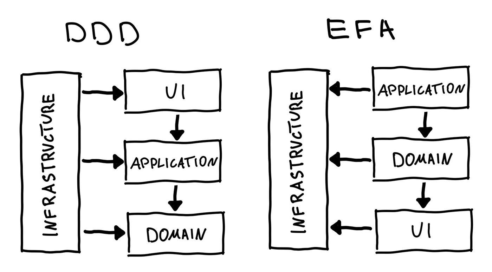

# Vue Layered Arch

Este projeto tem como objetivo ser um exemplo de implementação (ou até mesmo um _boilerplate_) do que chamamos de **EFA (Elegant Front-end Architecture)**. Essa abordagem é uma combinação de arquiteturas e _design patterns_ clássicos, podendo ser considerada o equivalente ao **DDD (Domain-Driven Design)** no contexto do front-end.



A implementação é independente de frameworks e ferramentas específicas. No entanto, neste repositório você encontrará uma estrutura que considero ideal para esse caso em projetos Vue 3 utilizando a Composition API.


## Organização do Projeto

```
src
├── application
├── domain
├── ui
├── infrastructure
├── utils
└── main.ts
```

A semelhança com o DDD é clara, mas vale reforçar: **você não precisa dominar DDD para adotar essa organização, e muito menos ficar engessado por ela**. Trata-se apenas de uma proposta bem definida e organizada para estruturar projetos Vue mais robustos e escaláveis.

## Observações

Alguns pontos da organização podem ser considerados subjetivos. Por exemplo, o arquivo `main.ts` está localizado diretamente na pasta `src`, mas ele poderia estar em outra camada, como `infrastructure`, dependendo da interpretação.

Outro ponto é a ausência da pasta `assets` em `src`, normalmente usada para armazenar configurações do Tailwind. No contexto dessa arquitetura, ela poderia estar dentro de `infrastructure`, já que envolve uma dependência externa de estilização.

Como mencionado, a proposta é flexível. Adapte-a de acordo com as preferências da sua equipe ou com o que fizer mais sentido para o seu projeto.

## Recursos Utilizados

- [Vue 3.5.7](https://vuejs.org/)
- [Tailwind CSS 4.1.11](https://tailwindcss.com/)
- [TypeScript 5.8.0](https://www.typescriptlang.org/)
- [Vite 7.0.0](https://vitejs.dev/)
- [Vue Router 4.5.1](https://router.vuejs.org/)
- [Pinia 3.0.3](https://pinia.vuejs.org/)

## Como Rodar o Projeto

Siga os passos abaixo para executar o projeto localmente:

```bash
# Instale as dependências
npm install

# Rode o servidor de desenvolvimento
npm run dev
```

> Certifique-se de ter o [Node.js](https://nodejs.org/) instalado (versão recomendada: 18+).

## Fontes Utilizadas

- [Domain-Driven Design Reference - Eric Evans](https://domainlanguage.com/ddd/reference/)
- [How to structure frontend application - Michal Zalecki](https://michalzalecki.com/elegant-frontend-architecture/)
- [Vue.js - Official Guide](https://vuejs.org/guide/introduction.html)
- [Tailwind CSS Documentation](https://tailwindcss.com/docs)
